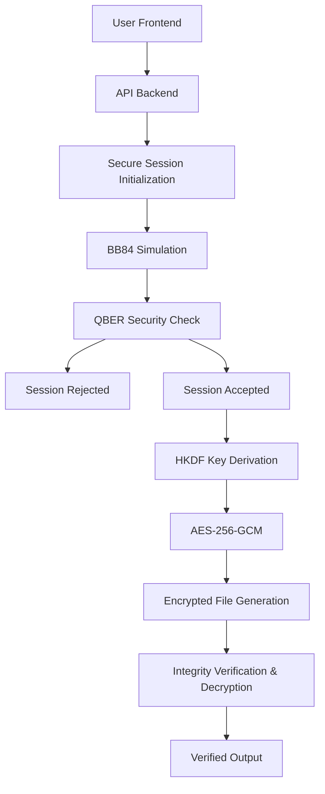

# QVERA — Secure File Transfer Web Application
**Implementation Plan, System Architecture, Workflow & Technology Documentation**
*Technical Documentation of the Final Implemented Application*

---

## 1. Executive Summary
QVERA is a secure file-transfer web application that demonstrates the integration between modern symmetric cryptography and quantum key distribution concepts. The application addresses the challenge of secure key establishment out-of-band by combining a Computational BB84 Simulation for key agreement with robust AES-256-GCM authenticated encryption for file protection.

Intended for academic, experimental, and technical demonstration purposes, the web application allows users to orchestrate a file transfer while dynamically analyzing the security metrics (QBER) generated by the underlying BB84 key agreement simulation. 

**Important Note:** QVERA uses a *Computational BB84 Simulation*. It does NOT use physical quantum hardware or actual photon transmission. The eavesdropper (Eve) is a controlled intercept-resend simulation. The file receiver (Bob) is modeled as a localized, simulated backend storage endpoint for demonstration purposes.

## 2. Project Objectives
The finalized features implemented in QVERA include:
- A secure file-transfer workflow integrating computational key generation with physical file encryption.
- A computational BB84 (Quantum Key Distribution) demonstration.
- QBER-based security evaluation to dynamically reject compromised communication channels.
- Authenticated file encryption utilizing AES-256-GCM and HKDF-SHA256.
- Integrity verification applied to securely decrypted transfer artifacts.
- A user-friendly "User Mode" for simplistic transfers, alongside an exposed "Tech Demo Mode" exposing cryptographic payloads.
- Persistent session tracking and transfer history.
- Granular technical event logging tracking the pipeline lifecycle over SQLite.

## 3. Application Overview
The QVERA application enables users to select a physical file from their local device and orchestrate a transfer to a simulated receiver endpoint. During this execution, a backend Python server orchestrates a BB84 simulation to generate a shared symmetric key between Alice (source) and Bob (destination). Based on the resulting Quantum Bit Error Rate (QBER), the application accepts or blocks the transaction.

If accepted, the key material is passed into a Key Derivation Function (HKDF) to establish a 256-bit AES key. The file is uploaded, encrypted into cipherbytes, and materialized in a simulated local destination directory. The backend then decrypts the file independently to cryptographically verify its signature tag before passing the final greenlit verification to the frontend UI.

**High-Level Workflow Architecture:**


## 4. Technology Stack
The application logic was engineered across the following localized stack:

| Technology | Layer | Purpose | Usage in QVERA |
|------------|-------|---------|----------------|
| **React** (v18+) | Frontend | Core declarative UI | Controls the frontend application lifecycle and DOM state. |
| **Vite** | Frontend | Build Toolchain | Compiles the React SPA, executing rapid HMR for development. |
| **Tailwind CSS** | Frontend | Styling | Handles all responsive grid layouts and glassmorphism styling. |
| **Lucide-React** | Frontend | Icons | Provides semantic iconography across the platform. |
| **Axios** | Frontend | Network Comm | Initiates asynchronous REST API calls to the Python backend. |
| **Python 3** | Backend | Core Logic | Orchestrates cryptography, routing, and database operations. |
| **Flask** | Backend | API Server | REST API router operating the `session`, `transfer` & `quantum` blueprints. |
| **PyCryptodome** | Backend | Cryptography | Provides the standard AES-GCM and SHA256 primitives utilized. |
| **SQLAlchemy** | Database | ORM | Translates Python objects into SQLite relational mapping tables. |
| **SQLite3** | Database | Persistence | Disk-based data storage for histories and logs. |

## 5. System Architecture
The application executes within a modern distributed client-server paradigm, decoupled by a stateless REST API layer, storing persistent metadata in SQLite.

1. **Presentation Layer (React/Vite)**
   - Renders the interactive User and Technical mode dashboards.
2. **API Interaction Layer (Flask/CORS)**
   - Parses incoming HTTP form payloads and orchestrates UUID provisioning.
3. **Cryptography & Security Layer (Python/PyCryptodome)**
   - Operates independent `bb84.py`, `key_derivation.py`, and `aes_gcm.py` modules detached from direct web delivery.
4. **Data Layer (SQLAlchemy)**
   - Logs security events and transfer records without absorbing physical file payloads.
5. **Simulated Output Layer (File System OS)**
   - Saves final decrypted cipher payloads into `/uploads` and simulated user directories.

## 6. Frontend Architecture
Built atop Vite, the frontend utilizes comprehensive state management hoisted effectively in an `AppContext` standard. 
- **Routing:** `<BrowserRouter>` orchestrates paths including `/` (Dashboard), `/transfer`, `/history`, `/monitor`, `/logs`, `/settings`, and `/about`.
- **State Management:** Core contextual variables like `phase` (IDLE, ENCRYPTING, VERIFIED) and `mode` (NORMAL vs TECHNICAL) are maintained via Context Providers to prevent wiping data when switching pages.
- **Safety Overrides:** Implements an `isProcessing` lock blocking interaction double-clicks while the backend is engaged in synchronous cryptographic operations.

### Major Sub-Pages:
| Page | Purpose | Backend Interaction |
|------|---------|---------------------|
| `Transfer` | Orchestrates the primary upload interaction ring. | Hits `/session/new`, `/quantum/start_bb84`, `/transfer/encrypt`, and `/transfer/decrypt`. |
| `Monitor` | Presents high-level real-time overview of current sessions. | Hits `/session/current` and recent transfer metrics. |
| `Settings` | Modifies simulation constraints (Qubits, threshold, Eve). | None directly. State mutates Frontend contextual flags sent on next transfer. |

## 7. Frontend User Experience
The UX was rigidly designed distinguishing **User Mode** from **Tech Demo Mode**.
- **User Mode:** Simplifies the display strictly to File Upload, Destination Selection, Security Status Validation, and Completion logic. Intended to abstract quantum mathematics away from the end-user.
- **Tech Demo Mode:** Appends technical side-tables, visually demonstrating BB84 execution logs, sifted key bit quantities, Eavesdropper node pathways, and explicit encryption cipher byte sizes.

## 8. Backend Architecture
Flask acts as the monolithic command center structured via modular Blueprints:
- `api/session.py`: Database operations initializing unique UUID tracking maps.
- `api/quantum.py`: Simulation of the QKD constraints, holding generated keys securely in localized RAM (`in_memory_key_store`).
- `api/transfer.py`: Catches physical `multipart/form-data` uploads, parses constraints (`MAX_FILE_SIZE_MB`), reads ciphertext streams, validates hashes, and touches disk metadata.

## 9. Application Workflow
**Standard Operational Flow (`Tech Demo Mode` with Success Condition):**
1. User drops file into workspace.
2. User accepts the `Bob - Local Simulation Receiver` default endpoint.
3. Hits **Secure & Send**. Application locks (`isProcessing` flag).
4. `POST /api/session/new` → Creates session UUID in SQLite.
5. `POST /api/quantum/start_bb84` → Executes computational Alice/Bob generation sequence.
6. Backend calculates QBER. If < `0.10` threshold, it accepts the handshake.
7. Backend derives AES key via HKDF (cached in RAM).
8. `POST /api/transfer/encrypt` → Frontend streams payload. 
9. Backend encrypts, stores payload. returns cipher stats.
10. `POST /api/transfer/decrypt` → Backend verifies payload integrity, extracting origin file.
11. UI populates green **VERIFIED** confirmation phase.

## 10. BB84 Implementation
Implemented mathematically within `quantum/`, the process executes completely within CPU constraints, tracking classical array iterations:
- **Alice:** Generates `N` random bits and `N` random basis strings (`+` and `x`).
- **Bob:** Generates `N` random measurement basis strings.
- **Reconciliation:** Arrays are compared mathematically. Bits where bases overlap are saved into the `Sifted Key`.
- **Memory Security:** Keys never leave backend RAM environments, rendering interception impossible without runtime host attacks.

## 11. QBER Security Mechanism
The Quantum Bit Error Rate (QBER) acts as the operational security heuristic:
- **Formula:** `QBER = (mismatched bits in sample) / (total bits in sample)`
- **Behavior:** Sifted Key arrays are tested. If the disturbance exceeds the application-defined configuration (default `10%` threshold) the system halts all cryptography, flagging `SECURITY_STATUS = FAILED`. No AES key is produced, breaking the transfer capability permanently for that session.

## 12. Eve Simulation
An optional intercept-resend attack parameter (`eve_enabled`).
- If enabled via settings, the BB84 backend loop routes Alice's photons through an Eve module.
- Eve intercepts states using random bases, inevitably collapsing Alice's specific configuration probabilistically.
- When Bob later measures Eve's re-encoded photon, inconsistencies cascade upward mathematically.
- This creates elevated QBER margins (typically ~25%), definitively failing the threshold check and proving the disturbance identification protocol.

## 13. Key Derivation
Following an approved QBER analysis, QVERA transforms raw BB84 bitstrings into strong symmetrical standard keys:
- The `Sifted Key` acts as Input Keying Material to an **HKDF-SHA256** implementation (`pycryptodome`).
- Outputs a normalized 256-bit byte vector ready to seed directly into the AES cipher, normalizing potential variable lengths from simulated reconciliation pipelines.

## 14. AES-256-GCM Encryption
To protect payload confidentiality and natively confirm payload physical integrity, the application utilizes AES-GCM (Galois/Counter Mode).
- A 16-byte random IV/Nonce is generated per file transfer.
- The 256-bit derived key operates on the uploaded file stream.
- The cipher computes a strictly bound Authentication Tag.
- The payload sent to disk concatenates as `Nonce + Authentication Tag + Ciphertext` allowing the receiver (Bob) to reverse the extraction seamlessly.

## 15. File Transfer Architecture
The final encrypted output is temporarily materialized physically on the localized server operating system to simulate a persistent transition. 
- A `transfer_id` UUID defines the path.
- "Bob is represented as a local/simulated receiver in the current implementation."
- The file rests safely encrypted in `/uploads` maintaining complete isolation from the standard executable code base, protected further by an OS environment configured max-size cutoff mapping natively in `python-dotenv`.

## 16. Integrity Verification
The integrity module operates symmetrically against the transfer framework. When the frontend flags `/decrypt`:
- The backend parses the stored file payload array.
- Extracts the authentication tag natively supplied by PyCryptodome's GCM suite.
- If a hypothetical storage attack modified standard bits inside the Ciphertext, the AES decryption phase permanently throws a `ValueError`—the application catches this, immediately rejecting the integrity flag and notifying the Frontend of a severe security failure.

## 17. Database Design
SQLite operates synchronously on standard flatfile. No secret arrays, symmetric AES keys, or HKDF seeds are physically maintained here.

| Table Name | Primary Purpose | Key Fields |
|------------|----------------|------------|
| `sessions` | Master root identifying transfer configuration and global status | `session_id` (PK, UUID), `qber`, `security_status`, `qubit_count` |
| `transfers` | Orchestrates physical byte tracking per file against the linked session | `transfer_id` (PK), `session_id` (FK), `file_size`, `filename`, `integrity_status` |
| `security_events` | High volume event logger designed exclusively for the Technical Dashboard output | `event_id` (PK), `session_id` (FK), `event_type`, `description` |

## 18. Session Management
Lifecycle states mapping the frontend DOM to backend SQLite configurations:
`IDLE` → `INITIALIZING` (User hits Secure & Send) → `BB84_RUNNING` (Python calculates matrices) → `SECURITY_CHECK` (QBER validated against configuration threshold) → `FAILED` (if Rejected) **OR** `ENCRYPTING` (AES engaged) → `TRANSFERRING` → `DECRYPTING` (Verifying Tag) → `VERIFIED` (Successful operation loop).

## 19. Logging Architecture
The `security_events` table executes rapid `.add()` commits executing throughout the transfer loop providing analytical data.
- Stores variables like `BB84_COMPLETED`, `SECURITY_CHECK_PASSED`, and `TRANSFER_STARTED`.
- **Note:** Strict omission safeguards are enforced across these backend queries ensuring mathematical key strings never leak into the logging architecture payload or subsequent Frontend API results.

## 20. Security Features
- **Implemented:** Full isolation of cryptographic derivations localized seamlessly within short-lived dictionary RAM structures holding the active execution pipeline context. Path-traversal overrides actively sanitize incoming file requests generated. Dynamic CORS restriction capability mapping to `$CORS_ORIGINS`.
- **Not implemented/Future Architecture:** Dedicated hardware physical QKD implementation, Remote TLS/SSL socket streaming for Bob, hardware-level key isolation modules.
## 21. Error Handling

The application protects transaction stability gracefully:

- **Client Disconnection or Oversized Payload:** The API actively monitors payload arrays throwing `413 Request Entity Too Large` blocking memory overloads. The UI catches the generic block, releasing the UI lock mechanism and alerting the User to re-attempt execution.

- **QBER Threshold Rejection:** The backend proactively aborts AES Key Derivation generating a hard `SECURITY_STATUS = FAILED`. The frontend dynamically triggers the red rejection container outlining specifically that external disturbance occurred.


## 22. UI/UX Architecture

Application interfaces map explicitly tracking visual modes:

- **Loading:** Buttons transition to semi-transparent interactive disables (via tracking standard `isProcessing`), ensuring standard click spamming does not duplicate backend pipeline executions.

- **Blocked/Failure:** Generates distinct red `ShieldAlert` modals terminating standard transfer interfaces explicitly demanding the user re-initiate safely.

- **Success:** Translates output pipelines delivering explicit download links rendering clear green UX completions rendering file verification safe.


## 23. Dashboard

The core interface wrapper. Acts as an aggregated statistics board rendering total system lifetime calculations pulling from API aggregations detailing `Total Secure Transfers` and overall `Blocked Sessions`.


## 24. Secure Transfer

The primary orchestration node bridging the visual connection demonstrating Alice `â   ` Node Selection `â   ` Bob. Incorporates timeline tracking iterating `IDLE`, `BB84_RUNNING`, `ENCRYPTING`, `TRANSFERRING`, and `VERIFIED`.


## 25. Transfer History

A query wrapper targeting `/api/transfer/history` loading historical arrays populating past transactions, indicating size, output logic, and explicitly rendering the distinct QBER identification percentages tied directly to past instances. Highly strict rule omits exposing historical keys or session initialization arrays protecting previous state records.


## 26. Security Monitor

Designed strictly to answer: *"What is happening right now?"* 

Dynamically polls backend states reflecting active sessions. Renders overarching security statistics including BB84 sifted limits, Eve operational thresholds, and realtime backend states highlighting current pipeline operation identifiers.


## 27. Technical Logs

Answers explicitly: *"What occurred inside the security session?"*

Iterates SQLite database `security_events` producing timestamp-oriented payloads demonstrating backend operations. Supports simple frontend arrays indicating severity logic (`ERROR`, `SUCCESS`, `CRITICAL`).


## 28. Settings

Controls global AppContext variants:

- **Qubit Count:** Size of standard initialization structure array (Default: 1024).

- **Security Threshold:** Cut off configuration for standard QBER disturbance verification (Default: 0.10).

- **Eavesdropper Simulation:** Flips active logic forcing Alice arrays to route probabilistically through simulated interception blocks. (Default: Off).

- **Application Mode:** Dictates DOM output structure displaying Tech statistics vs User minimalistic architecture. (Default: Normal)


## 29. About

Provides localized documentation dictating project guidelines directly within the UI, demonstrating the boundaries regarding physical implementation frameworks versus local mathematical simulation boundaries. 


## 30. API Architecture

```mermaid

sequenceDiagram

    participant User as Frontend (React)

    participant Flask as API Services

    participant Q_Sim as Quantum Engine

    participant Crypto as Crypto Engine


    User->>Flask: POST /api/session/new (params)

    Flask-->>User: session_id

    User->>Flask: POST /api/quantum/start_bb84

    Flask->>Q_Sim: Simulate States & Reconcile

    Q_Sim-->>Flask: QBER & Status

    Flask-->>User: Security Results

    User->>Flask: POST /api/transfer/encrypt (FormData)

    Flask->>Crypto: Derive HKDF AES Key

    Crypto-->>Flask: AES Key

    Flask->>Crypto: AES-GCM Encrypt & Tag

    Flask-->>User: transfer_id

    User->>Flask: POST /api/transfer/decrypt

    Flask->>Crypto: Verify Tag & Decrypt

    Crypto-->>Flask: Verification OK

    Flask-->>User: Success Status

```


## 31. Component / Module Map

| File / Module | Layer | Responsibility |

|---------------|-------|----------------|

| `backend/quantum/bb84.py` | Core Sim | Handles mathematical state reconciliation and intercept logic. |

| `backend/crypto/aes_gcm.py`| Crypto | Exclusively handles python standard symmetrical isolation processes. |

| `frontend/src/App.tsx` | View | Root router providing dynamic contextual wrappers across variables. |

| `backend/api/transfer.py` | API | Validates HTTP payloads tracking max file parameters intercepting bytes. |

| `frontend/src/api.ts` | Comm | Manages Axios instances reading direct localized `.env` structures. |


## 32. Data Flow

Standard User payloads execute via the `FormData` multipart system reaching the server bytes immediately. Once verified and encrypted, encrypted payloads are generated in `./uploads/`. Decrypted verifications map memory operations never writing the cleartext explicitly long term protecting system resources. Secret cryptographic bytes exclusively inhabit dynamic python dictionary maps (`in_memory_key_store`) that automatically deallocate when operational pipelines reset avoiding physical database intrusion risks.


## 33. Deployment Architecture / Readiness

The finalized iteration exists in a deployment-ready local container:

- **Variables Configured**: Utilizes standard `.env` mapping variables including $CORS_ORIGINS natively rendering integration into arbitrary hosting frameworks seamless via standard `gunicorn` configurations traversing `python-dotenv`.

- **Frontend Distribution**: The frontend fully bundled via standard `vite build` into a strict HTML/CSS/JS output tree minimizing load overhead, capable of rapid static hosting on remote CDNs.


## 34. Testing

Extensive integration loops tracked successful execution pathways:

1. **Valid Transfer Array:** Triggering transfer successfully orchestrates AES encryption confirming the verified callback flag.

2. **Double Click Exploit:** Verified React UX prevents UI spam utilizing `isProcessing` lock blocks.

3. **Eve Simulation Override:** Confirmed `eve_enabled` flag inherently increases measured error rates blocking transfer operations as per programmatic architecture. 

4. **Invalid Files:** Max size constraint logic automatically overrides standard memory limits catching oversized physical file dumps gracefully.


## 35. Limitations

- **Simulation Domain:** True Quantum Key Distribution requires physical quantum optics arrays executing over specialized fiber systems; this application represents a software simulation architecture executing mathematically inside standard processing frameworks.

- **Receiver Architecture:** Bob does not operate currently via independent remote machine socket interfaces, and is thus represented logically through internal API endpoint resolution structures operating on the central Flask hub execution layer.


## 36. Future Enhancements

Should the project graduate beyond academic demonstration:

- Real network TLS transport mechanics establishing physical separations between sender and receiver instances.

- Active integration with cloud object storage modules mapping payloads externally into S3 instances via dynamic AWS connections substituting localized SQLite structures tracking independent container clusters.


## 37. Implementation Summary


| Area | Implemented Technology / Approach |

|------|------------------------------------|

| Frontend | React, Vite, Tailwind CSS, Lucide |

| Backend | Python 3, Flask REST API |

| Database | SQLite3 managed via SQLAlchemy |

| Quantum Simulation | Computational Random Bit Arrays vs simulated Bases |

| Key Derivation | HKDF executing via SHA-256 |

| Encryption | PyCryptodome AES-256-GCM |

| File Transfer | HTTP Request mapping `multipart/form-data` |

| Integrity | Local authentication utilizing AES Galios Tag signatures |

| Deployment | Bundle ready local distribution mapping via `.env` files |


## 38. Panel Explanation Guide

*Brief configurations explaining standard QVERA terminology to review personnel.*


- **What is QVERA?** A secure file transfer application relying on computational Quantum Key Distribution concepts mapped logically alongside traditional verified AES standards.

- **Why was this format selected?** Integrating frontend React with backend Flask offers dynamic state communication combined flawlessly alongside advanced Python computational libraries rendering AES processing native.

- **What is BB84 doing?** Mathematically generating secure bit instances testing localized channels simulating photon behaviors establishing a baseline cryptographic standard.

- **What happens when QBER escalates?** Symmetrical threshold limitations override standard transfer arrays preventing active handshakes terminating session connections prior to encryption occurring avoiding exposure. 

- **What is Eve represented as?** Computational interception mechanics utilizing algorithmic operations mimicking typical attacker monitoring techniques proving standard network vulnerability mechanics. 

- **Why AES-GCM?** Enforces authenticated integrity confirming zero bytes have been altered over time inherently solving structural tampering challenges organically alongside confidentiality frameworks.


---

*Generated based exclusively on the active QVERA workspace configuration and active code constraints.*

